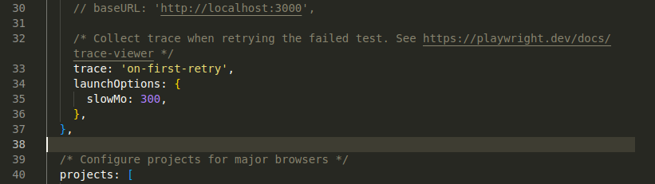

# Playwright E2e Testing

## Commands Used

### 1. Setup & Initialization
- **`npm init -y`**
  - Initialized a blank Node.js project with default settings (created `package.json`).
- **`npm init playwright@latest`**
  - Installed Playwright and set up the testing environment (config files, GitHub Actions, browsers).

### 2. Configuration Fixes
- **`mv y tests`**
  - Renamed the directory `y` to `tests` (corrected an accidental input during initialization).

### 3. Test Generation
- **`npx playwright codegen https://todomvc.com/examples/react/dist/`**
  - Opened the Playwright Inspector to record browser interactions and auto-generate the test code found in `tests/todo-demo1.spec.js`.

### 4. Running Tests
- **`npx playwright test`**
  - Executed all tests in headless mode across all configured browsers (Chromium, Firefox, WebKit).
- **`npx playwright test --headed --grep @sanity`**
  - Ran only tests containing the `@sanity` tag in headed mode (visible browser window).
- **`npx playwright test --headed --grep @sanity --project=chromium`**
  - Ran `@sanity` tests using **only Chromium** to bypass the `Host system is missing dependencies` error encountered with WebKit.

- **`npx playwright test --ui`**
  - Opens the Playwright Inspector to record browser interactions and auto-generate the test code found in `tests/todo-demo1.spec.js`.

- **`npx playwright test --debug`**
  - Opens the Playwright Inspector to record browser interactions and auto-generate the test code found in `tests/todo-demo1.spec.js`.

### 5. Debugging & Reports
- **`npx playwright show-report`**
  - Opens the HTML test report to view details of the last test run.

- In config file add scripts to take screenshot on failure. Make some assertion to fail the test. run and check the report
```
    browserName: 'chromium',
    screenshot: 'only-on-failure',
    video: 'retain-on-failure'
```


In config file `playwright.config.js` we added the below code to slow down the test execution by default it will be too fast.
```
launchOptions: {
      slowMo: 300,
    },
```
